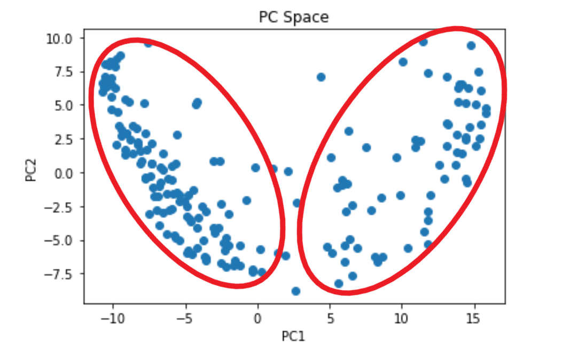
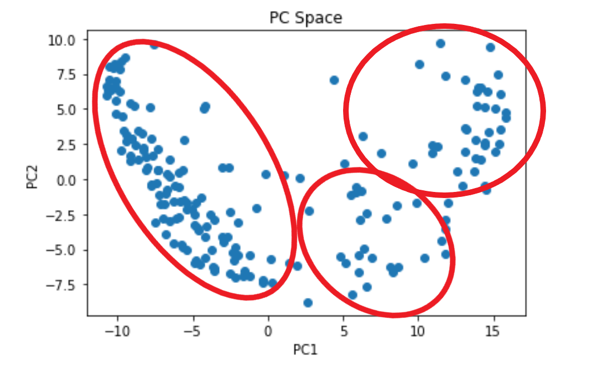

---
jupytext:
  formats: ipynb,md:myst
  text_representation:
    extension: .md
    format_name: myst
    format_version: 0.13
    jupytext_version: 1.13.0
kernelspec:
  display_name: Python 3 (ipykernel)
  language: python
  name: python3
---

# Assignment 3

Andrew Loeppky

EOSC 510

+++

## Problem 1 

You are given two timeseries $x_1$ and $x_2$ (`data.mat` or `data.csv`), each one containing 310 points in time. For each
timeseries, you'd like to investigate how the characteristic temporal patterns change in time, so you decide to
use the singular spectrum analysis (applied on each timeseries separately) with a total lag of $L=50$ days.

Tasks:
1) Plot the timeseries and create the lagged matrix for each of the timeseries. Show (in symbolic matrix form)
how your lagged matrix looks like for $x_1$.

$$
X =
\left[ {\begin{array}{cc}
    x_1(0) & x_1(1) & x_1(2) & ... & x_1(N-L+1)\\
    x_1(1) & x_1(2) & x_1(3) & ... & x_1(N-L+2) \\
    \vdots & \vdots & \vdots & \ddots & \vdots\\
    x_1(L) & x_1(L+1) & x_1(L+2) & ... & X_1(N)
\end{array} } \right]
$$

```{code-cell} ipython3
# get the data and plot it
```

2) Perform SSA. Plot the eigenvectors and PCs of the most important modes (decide yourself how many modes
are important) for $x_1$ and $x_2$. Hint: in SSA we are interested in the pairs of modes.

```{code-cell} ipython3
plot_pcs(fracVar_x1, "$x_1$")
plot_pcs(fracVar_x2, "$x_2$")
```

Based on the above plots, I want to keep the first 4 modes for $x_1$ and the first 6 for $x_2$

```{code-cell} ipython3
plot_PCs(PCs_x1, eigvecs_x1, 4, "=" * 20 + "  $x_1$  " + "=" * 20)  # for x1
plot_PCs(PCs_x2, eigvecs_x2, 6, "=" * 20 + "  $x_2$  " + "=" * 20)  # for x2
```

3) How much variance is carried by the dominant signals (signals of different frequencies) in $x_1$ and how much
in $x_2$? Note that in SSA, a signal of given frequency is usually captured by two modes.
> for $x_1$, the frist two modes carry 74\% of the variance

>for $x_2$, the first two modes carry 57\% of the variance

```{code-cell} ipython3
# first two modes of x1
print(sum(fracVar_x1[:2]))
print(sum(fracVar_x2[:2]))
```

## Problem 2

You are given a data (data_problem2.mat or data_problem2.csv) that contains one year of normalized daily
streamflow from 194 rivers in Alberta, Canada (i.e. there are 194 stations, each with 365 days of normalized
streamflow). The locations of each station are given by a latitude/longitude coordinate pair in stationLon.mat
and stationLat.mat (or stationLon.csv and stationLat.csv). ABlon.csv and ABlat.csv give coordinates of the
Alberta border for plotting (e.g. plt.plot(lon,lat) or figure; plot(lon, lat) will plot the border).
Following the guidelines below, perform two types of clustering to investigate how to cluster these stations
across the region on the basis of similarity in their streamflow regimes.

*Note: apply PCA on the data first (m=365, n=194) and then perform clustering (hierarchical
clustering and SOM) on the first few modes only. Most likely the first 3 modes will be enough to
keep. In the final plots, make sure that you reconstruct the data (streamflow) from the clustered
PC modes, as was done in the Tutorial example on SST dataset.*

+++

Tasks:
1) Perform the hierarchical clustering (if using Matlab, use Ward's method) on the data. Plot the dendrogram.

```{code-cell} ipython3
# do PCA
```

```{code-cell} ipython3
# plot the eigvecs and PCs
plot_PCs(PCs, eigvecs, 2, " ")
```

```{code-cell} ipython3
# plot PC-space -- can you see any clusters?
plt.scatter(PCs[:,0],PCs[:,1])
plt.xlabel('PC1')
plt.ylabel('PC2')
plt.title('PC Space');
```

```{code-cell} ipython3

```

2) Choose two possible options for the optimal number of clusters (k) from the dendrogram and provide some
explanation on why you chose those k.


For each choice of k:

**a)** plot the mean streamflow pattern of each cluster


**b)** plot the clusters on the map of Alberta (lat/lon scatter-plot), i.e. color each station's location (can use a filled
circle as a marker) according to the cluster to which it belongs. Discuss what you think are two key differences between your results for two different choices of k

*by inspection, it appears that there are 2 somewhat distinct clusters, possibly 3*




```{code-cell} ipython3
# plot the mean stramflow pattern of each cluster
```

```{code-cell} ipython3
# show the stations
```

```{code-cell} ipython3
######################
##### 3 clusters #####
######################
```

```{code-cell} ipython3
# show the stations
fig, ax = plt.subplots()

for cluster_num in range(n_clusters):
    
    inds = np.argwhere(cn==cluster_num)
    #cluster_pattern_PC[cluster_num,:] = np.mean(data[inds,:],axis=0)
    #cluster_pattern[cluster_num,:] = np.mean(data[inds,:],axis=0)
    ax.scatter(stationlons[inds], stationlats[inds])

ax.plot(lons, lats, color="k")
ax.set_aspect("equal")
ax.set_title(f"Streamflow Stations in Alberta, {n_clusters} Clusters")
ax.set_xlabel("lon")
ax.set_ylabel("lat");
```

**interpretation**

With 2 clusters, we identify 2 patterns, one where streamflow shows a strong spike in the spring and another where the peak is later and flatter. 

With 3 clusters, we identify an intermediate mode where both spring runoff and the longer-period summer signal are apparent.

+++

## Problem 3

Perform clustering using a 3 x 2 SOM, and plot the resulting streamflow patterns as a 3 x 2 SOM. Plot the
locations of the stations, coloured according to the cluster (BMU) to which they belong. What is the frequency of
each cluster?

```{code-cell} ipython3
# show the stations
```

```{code-cell} ipython3
# what is the frequency of each BMU?
print(freq)
```

```{code-cell} ipython3
frq (0.0) = 0.247

frq (0,1) = 0.165

frq (1,0) = 0.022

frq (1,1) = 0.036

frq (2,0) = 0.149m

frq (2,1) = 0.180
```

## Problem 4

Perform clustering using 2 x 2 SOM, and plot the SOM patterns, locations of stations coloured by BMU, and
frequency of each cluster as in the case with 3 x 2 SOM. Discuss what you think are two key differences
between your results from 3 x 2 SOM and this SOM.

```{code-cell} ipython3

```

```{code-cell} ipython3
# show the stations
```

```{code-cell} ipython3
print(freq)
```

frq (0.0) = 0.175

frq (0,1) = 0.237

frq (1,0) = 0.196

frq (1,1) = 0.392
